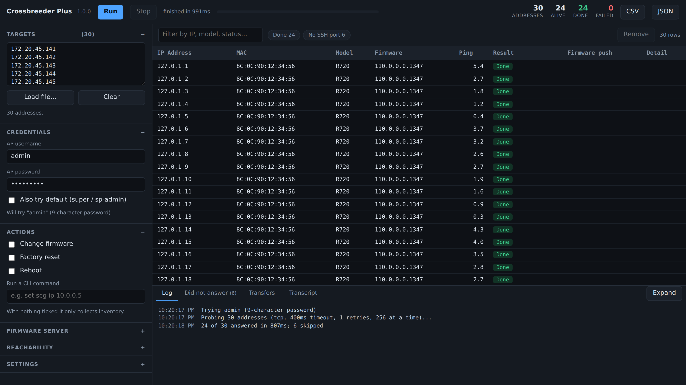

# Crossbreeder Plus

Bulk firmware changes, inventory and CLI work across standalone Ruckus access
points — **many at a time** instead of one after another. No controller, no
installer, no runtime: one binary that talks to each AP directly over SSH.

> Author: Andrea Coppini · Feedback: <andrea@tacoppini.com>

Measured against a live 558-AP estate: a full inventory sweep finishes in
**6.5 seconds**. The original Crossbreeder, working one AP at a time, takes over
an hour on a list that size.



## Download

Grab the file for your platform from the
[latest release](https://github.com/andreacoppini/crossbreeder/releases/latest):

| Platform | File |
|---|---|
| Windows | `crossbreeder-plus-windows-amd64.exe` (`-arm64` for Surface and Snapdragon) |
| Windows, zipped | `crossbreeder-plus-windows-amd64.zip` — same binary, for networks that block `.exe` downloads |
| macOS | `crossbreeder-plus-macos.zip` — one universal binary for Intel and Apple Silicon |
| Linux | `crossbreeder-plus-linux-amd64.tar.gz` (or `-arm64`) |

There is no installer. Unzip it and run it.

The binaries are unsigned, so both Windows and macOS warn on first launch. On
macOS the first run needs
`xattr -d com.apple.quarantine crossbreeder-plus-macos-universal`, or
right-click → Open. `SHA256SUMS.txt` in the release covers every file.

### If Windows Defender flags it

Defender has reported `Trojan:Win32/Wacatac.B!ml` against the Windows build.
The `!ml` suffix marks it as a machine-learning verdict rather than a match
against known malware, and `Wacatac` is Microsoft's catch-all family — the
bucket unsigned, low-reputation executables tend to land in.

What is worth knowing before you decide whether to trust it:

- Every binary is built by [GitHub Actions](.github/workflows/release.yml) from
  the tagged commit in this repository, not uploaded from a laptop. The commit
  is stamped inside the binary: `go version -m crossbreeder-plus-...` prints
  `vcs.revision`, and it should match the tag.
- `SHA256SUMS.txt` in the release covers every file, so you can confirm the
  download is the one that was built.
- Nothing is packed or obfuscated; the source for all of it is here.
- The tool does legitimately do what heuristics look for: it opens SSH sessions,
  sweeps address ranges with ICMP and TCP, serves files over HTTP, and handles
  credentials. That is the job, and it reads like a network tool because it is
  one.
- Each release is a new file that Defender has never seen, so reputation starts
  from nothing again every time.

None of that is proof of anything on its own. If you are not comfortable,
build it yourself — it needs only Go, and takes seconds:

```
go build -o crossbreeder-plus.exe .
```

If you hit this detection, reporting it to Microsoft at
<https://www.microsoft.com/en-us/wdsi/filesubmission> genuinely helps: their
false-positive review usually clears it within a few days and the correction
reaches everyone.

## Using it

Run it with **no arguments** — or double-click it — and it opens a console in
your browser, bound to localhost:

```
Crossbreeder Plus 1.0.0
Console: http://127.0.0.1:52413
```

Paste in your addresses (or load a CSV), set the AP credentials, tick what you
want done, press Run. With nothing ticked it collects inventory.

Everything the console does is also available from the command line, over the
same engine:

```
crossbreeder-plus -csv aps.csv -user admin -ask-pass -c 50 -out results.csv
```

The factory-default `super`/`sp-admin` login is tried after whatever credentials
you give, as the original did; `-default=false` or unticking **Also try default**
restricts a run to the credentials supplied.

### Update check

On launch it asks GitHub once whether a newer release exists, and says so — a
line after the run on the command line, a small badge beside the version in the
console. It never blocks or delays anything, says nothing at all when it fails,
and caches the answer for a day so a site behind one address does not hammer
GitHub's rate limit.

Turn it off with `-no-update-check`, or `CROSSBREEDER_NO_UPDATE_CHECK=1` in the
environment to switch it off for everyone at a site. It is the only connection
the tool makes that is not to an AP or to your own firmware server.

Use `-ask-pass` rather than `-pass`: `cmd.exe` eats `^` as an escape character,
every shell claims a different set, and an argument is visible in the process
list. Run `crossbreeder-plus -h` for the rest.

A factory-default AP demands a password change before it will do anything else.
As in the original Crossbreeder, it is set to **`Crossbreeder`** unless you say
otherwise, and the run carries on to whatever else you asked for. Change it with
the **New password** field or `-new-pass` (8 characters or more; the AP refuses
anything shorter), and switch the behaviour off with the **Change password if
the AP forces it** tick-box or `-change-pass=false`, which reports such APs and
skips them instead.

That default is worth knowing even if you never use it: APs already flashed by
the original tool are sitting on `Crossbreeder` as their password, so it is
often what belongs in the **AP password** field too. Leave it empty and those APs are reported
as needing one and skipped, rather than being guessed at.

## What it does

- **Pings first.** Most addresses on a site list are dead, and each one costs a
  single unanswered packet instead of an SSH handshake against a timeout.
  Addresses that never answer are listed, folded into ranges, and can be written
  out to re-run later.
- **Works the APs in parallel** — inventory, firmware, factory reset, reboot, or
  any AP CLI command, across ZoneFlex and Unleashed, at whatever concurrency the
  site can take. A firmware change cannot be combined with a reboot or a factory
  reset: `fw update` only *starts* the download, so restarting the AP would throw
  the image away.
- **Hosts the firmware itself.** A push needs nothing installed beyond this
  binary: it serves the images, works out which of your addresses the APs can
  actually reach, and shows what each one is downloading. Put `%M` in the
  filename — `%M_118.2.0.0.875.rcks` — and it becomes each AP's model, so one
  run pushes the right file to a mixed estate.
- **Follows the reboot.** After the first pass it keeps pinging and re-reading
  the version, so an AP that drops off reads as *rebooting* and one that returns
  on a new version is reported as *upgraded* — the push is confirmed rather than
  assumed.
- **Exports CSV and JSON**, with a row for every address including the silent
  ones.

## Changelog

One line per change, newest first. `!)` marks something that changes behaviour
you may be relying on; `*)` is everything else. The pull request has the detail
and the reasoning.

What's new in 1.0.6 (2026-09-19):

```
!) repo - the Go source moved to the repository root; the module is now github.com/andreacoppini/crossbreeder (#14);
*) console - the image/control file can be typed as well as picked, so %M reaches the console (#13, #14);
*) repo - the original Xojo version archived under legacy/ and no longer developed (#14);
*) docs - a changelog in the README, and a release now fails if its tag has no entry (#14);
```

What's new in 1.0.5 (2026-08-28):

```
*) update - check GitHub for a newer release on launch; cached for a day, silent on failure (#12);
*) login - try the factory-default super/sp-admin login by default, as the original does (#12);
*) console - pin the console's defaults to the command line's so the two cannot drift apart (#12);
```

What's new in 1.0.4 (2026-08-27):

```
!) firmware - a firmware change locks out reboot and factory reset, which discarded the push (#11);
*) login - set a forced password change to "Crossbreeder" unless told otherwise, as the original does (#11);
*) login - separate switch for changing the password, so turning it off keeps the password typed (#11);
*) login - refuse a new password under 8 characters once, before the run, not against every AP (#11);
```

What's new in 1.0.3 (2026-08-27):

```
*) release - the Windows binaries report an unmodified source tree again; v1.0.2 said otherwise (#10);
```

What's new in 1.0.2 (2026-08-27):

```
*) login - match the prompt strings the original Crossbreeder uses, not a reconstruction of them (#8);
*) login - decline the Unleashed setup wizard, which stalled a factory-default AP indefinitely (#8);
*) windows - stamp the version resource from the tag; earlier releases declared themselves 1.0.0 (#8);
*) windows - build the arm64 version resource as an arm64 object, which broke the release (#9);
```

What's new in 1.0.1 (2026-08-26):

```
!) login - a forced password change no longer kills the run and everything after it (#7, #5);
*) login - set a password on an AP that demands a change at first login, and carry on (#7);
*) packaging - publish zipped Windows builds for networks that refuse an .exe download (#6);
```

What's new in 1.0.0 (2026-08-25):

```
*) first release: parallel engine, ping sweep, browser console, built-in image server;
```

## Repository layout

| Path | |
|---|---|
| `*.go`, `ap/`, `web/` | Crossbreeder Plus — the Go source, tests and browser console |
| `docs/ARCHITECTURE-REVIEW.md` | why this was rebuilt rather than optimised in place |
| `docs/INTERNALS.md` | how the engine works, building it, and every flag |
| `docs/RELEASE-NOTES.md` | the text published with each release |
| `.github/workflows/release.yml` | builds and publishes every platform on a tag |
| `legacy/` | the original Crossbreeder, archived — source, last builds, and the abandoned attempt at making it concurrent |

Building it yourself needs only Go — see [`docs/INTERNALS.md`](docs/INTERNALS.md)
for how it works and what the flags do.

## The original Crossbreeder

The Xojo application this replaces is **archived in [`legacy/`](legacy/)** and is
no longer developed; the last builds of it are also at
**https://dogtag.tacoppini.com**. It remains the reference for what the tool is
meant to do — several behaviours here were recovered from its source rather than
reinvented, including the `super`/`sp-admin` fallback, `%M` model templating, the
forced-password-change handling and the Unleashed setup-wizard bypass.

[`legacy/multithreading-attempt/`](legacy/multithreading-attempt/) holds an
abandoned attempt to make that version work several APs at once. It is kept
because its notes record what was tried; why it could not work, and what was done
instead, is [`docs/ARCHITECTURE-REVIEW.md`](docs/ARCHITECTURE-REVIEW.md).

## Known limits

- The Unleashed dialect and pre-2015 ZoneFlex firmware (`-legacy`) have been
  exercised against a simulated AP, not real hardware.
- A firmware push is only ever *started* by the tool. The AP downloads and
  reboots on its own schedule, which is what the re-scan is there to follow.
- The binaries are unsigned on both Windows and macOS.
